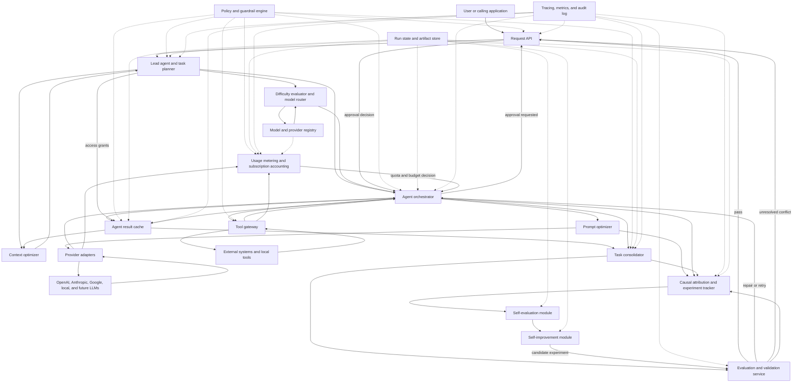
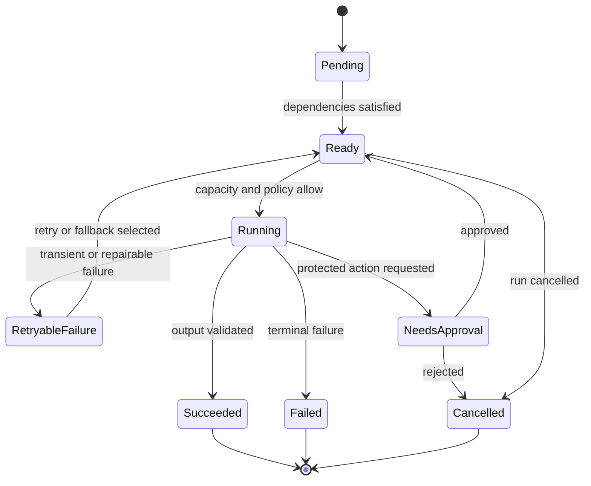

# TeamSwarm Architecture

Status: Verified architecture baseline v4

Last reviewed: 2026-07-28

## 1. Purpose

TeamSwarm is a provider-neutral platform for turning a user request into a
validated result produced by one or more LLM-backed agents.

The platform must:

- optimize and budget context for every model call;
- split complex requests into bounded tasks;
- estimate task difficulty and select a suitable model;
- optimize prompts using model- and provider-specific modules;
- orchestrate agents across different LLM providers;
- consolidate task results without losing provenance;
- evaluate component behavior and end-to-end output quality;
- track causal evidence between prompt and configuration changes and result
  quality;
- perform bounded self-evaluation of agent output;
- generate and test self-improvement proposals under controlled conditions;
- meter multi-dimensional model usage, quota consumption, and subscription
  allowance; and
- enforce cost, security, permission, retry, and concurrency policies; and
- preserve enough execution data to reproduce and compare runs.

The initial architecture uses a central lead-agent pattern. Peer-to-peer
handoffs may be added later, but they are not the default because centralized
planning and consolidation make execution easier to inspect, resume, and test.

## 2. Design principles

1. **Provider-neutral core, provider-specific adapters.** Core contracts do not
   depend on a vendor API. Adapters expose provider-specific capabilities
   without reducing everything to the lowest common denominator.
2. **Structured boundaries.** Components exchange versioned data structures,
   not unstructured prompt text.
3. **Deterministic control where practical.** Scheduling, budgets, permission
   checks, schema validation, retries, and hard constraints are implemented in
   code. LLM judgment is used for semantic planning and evaluation.
4. **Evidence-preserving consolidation.** Consolidation retains the origin of
   claims and reports unresolved contradictions rather than silently choosing
   an answer.
5. **Evaluation-driven routing.** Model-selection policies are promoted only
   after they pass representative evaluations for quality, latency, and cost.
6. **Least context and least privilege.** Each task receives only the context
   and tools necessary to complete it.
7. **Durable, resumable execution.** A run can be resumed from recorded state
   without repeating successful side effects.
8. **Causal claims require experiments.** Production traces can reveal useful
   correlations, but a component is credited with causing an improvement only
   after a controlled experiment or an explicitly documented causal method.
9. **Self-improvement is gated.** The system may propose and test changes, but
   it never silently changes production prompts, routing, policies, tools, or
   code.
10. **Shared results are capability-scoped.** An agent may access another
    agent's cached result only through an explicit, task-scoped grant created by
    the Lead Agent and enforced by the runtime.

## 3. System context



## 4. End-to-end request flow

1. The Request API authenticates the caller, creates a run, records budgets and
   policies, and assigns a trace ID.
2. The Context Optimizer retrieves, ranks, deduplicates, and compresses
   potentially relevant context.
3. The Lead Agent decides whether the request should run directly or be split
   into a task graph.
4. The Difficulty Evaluator scores each task. The Model Router selects a
   provider, model, execution settings, and ordered fallbacks.
5. The Orchestrator schedules ready tasks, subject to dependency, concurrency,
   permission, and cost constraints.
6. Usage Metering and Subscription Accounting reserves estimated usage against
   the applicable tenant, subscription, project, run, agent, and task budgets.
   It returns `allow`, `degrade`, `approval_required`, or `deny` before the
   model call is made.
7. Before each model call, the Context Optimizer creates a task-specific context
   package and the Prompt Optimizer renders a provider-specific request.
8. Provider Adapters invoke the selected model and normalize model output, tool
   requests, usage data, and errors. Tool requests are executed through the Tool
   Gateway and returned to the active task.
9. The Usage Metering module records provider-reported usage, releases unused
   reservations, updates usage aggregates, and reconciles estimates when an
   authoritative provider record becomes available.
10. The Orchestrator validates each task result and persists it. Failed tasks are
   retried or routed to a fallback according to policy.
11. The runtime publishes reusable result artifacts to the Agent Result Cache.
   The Lead Agent grants named downstream tasks and the Task Consolidator access
   only to the result handles they need.
12. The Task Consolidator merges successful outputs, detects contradictions and
   missing evidence, and produces a provenance-preserving consolidated result.
13. The Evaluation Service runs deterministic, semantic, trajectory, safety,
    cost, and regression checks.
14. The Causal Attribution and Experiment Tracker records the exact prompt,
    context, model, tool, output, and evaluation lineage for the run.
15. The Self-Evaluation Module may create a bounded critique of the result. It
    can request a repair, but does not itself accept the result.
16. A passing result is returned. A repairable failure creates a bounded repair
    task. Approval-sensitive or unresolved failures are returned to the caller
    with the relevant evidence. The Self-Improvement Module operates offline on
    completed, sanitized run data and can only propose candidate changes.

## 5. Core components

### 5.1 Request API

Responsibilities:

- authenticate and authorize callers;
- accept requests, constraints, budgets, and optional output schemas;
- expose run status, cancellation, streaming events, and final results;
- enforce idempotency for run creation and side-effecting operations; and
- translate external requests into the canonical `RunRequest`.

The API does not contain planning, prompt, or provider logic.

### 5.2 Context Optimizer

Responsibilities:

- ingest conversation history, project artifacts, retrieved documents, tool
  output, and previous task results;
- classify context by source, sensitivity, freshness, authority, and task
  relevance;
- deduplicate and rank context;
- summarize or compress lower-priority material;
- enforce task- and model-specific token budgets;
- preserve references to omitted or summarized sources; and
- cache context packages using content and policy hashes.

Every context item retains provenance. Generated summaries are separate
artifacts and never replace their original sources.

The first implementation should use deterministic token budgeting,
source-priority rules, and retrieval scoring. Learned context selection can be
added only after a baseline evaluation suite exists.

#### Context-optimization delivery plan

1. Build a canonical context inventory with content hash, source type,
   sensitivity, authority, freshness, token estimate, and provenance for every
   candidate item.
2. Apply deterministic selection in this order: policy filtering, exact
   deduplication, required dependency artifacts, source-priority ranking, then
   task-relevance ranking. The optimizer must reserve tokens for instructions,
   output schema, and expected output before it allocates evidence.
3. When the budget overflows, replace lower-priority material with versioned
   summary artifacts. Summaries must cite their source artifact IDs, state their
   coverage and loss characteristics, and remain separate from the originals.
4. Emit a context manifest containing selected, summarized, and omitted items;
   their token allocations; and the policy and optimizer versions. Persist this
   manifest in the task trace and use its hash in cache eligibility checks.
5. Evaluate the deterministic baseline for evidence recall, answer quality,
   input-token reduction, and overflow behavior before enabling semantic
   retrieval or learned selection.

#### Hybrid repository-context roadmap

Repository context is selected by complementary retrieval signals; a code graph
does not replace exact or semantic search.

1. **Lexical and structural baseline.** Parse supported languages into typed
   repository, file, symbol, and test nodes. Seed retrieval with exact paths,
   identifiers, diagnostics, and BM25-style term scores, then expand only one or
   two typed graph hops through calls, imports, references, inheritance, and test
   relationships. Render compact signatures first and exact snippets only for
   the highest-ranked evidence. The initial implementation supports Python AST
   symbols and direct call edges behind an opt-in setting.
2. **Hybrid semantic retrieval (implemented for Python).** Add contextual chunk
   headers and deterministic local feature-hash embeddings, fuse lexical,
   semantic, and graph rankings, and deduplicate before a bounded reranker.
   Preserve the winning signal, score, embedding/index versions, repository
   revision, path, symbol, and line span in every manifest entry. Learned
   embedding adapters remain a later, evaluation-gated enhancement.
3. **Hierarchical context.** Maintain versioned repository/package summaries,
   symbol skeletons, exact snippets, and compact agent handoffs. Select fidelity
   by task and risk; never lossily compress policies, schemas, code being edited,
   exact diagnostics, or acceptance criteria.
4. **Evaluation-gated learning.** Compare every change with the deterministic
   baseline on evidence recall, patch/test success, hallucinated symbols, input
   tokens, time to first token, total latency, and cache-hit rate. Learned
   selection and reranking require a replayable evaluation corpus and rollback.
5. **Offline prompt compilation.** Generate and score instruction and example
   candidates using a DSPy/OPRO-style optimizer. Store candidates as immutable
   prompt versions and promote them only after quality, security, cost, and
   latency regression gates; production workers never rewrite live prompts.

Retrieved files, documents, tool output, and agent artifacts remain untrusted
data even when highly ranked. Policy filtering happens before retrieval, and
tool authorization is enforced outside the model after retrieval.

SGLang prefix caching can make repeated, identical prompt prefixes cheaper and
faster, but it is a serving optimization rather than an authorization boundary.
TeamSwarm therefore shares only immutable, policy-approved prefix material and
still constructs and traces each task's logical context package independently.

### 5.3 Lead Agent and Task Planner

Responsibilities:

- interpret the desired outcome and acceptance criteria;
- decide between direct execution and multi-task execution;
- create a directed acyclic task graph;
- identify parallelizable work and dependencies;
- define required capabilities, tools, input, output schema, and completion
  criteria for each task;
- issue explicit result-cache access grants for downstream tasks and the Task
  Consolidator;
- declare consolidation strategy and evaluation requirements; and
- mark operations that require user approval.

The Lead Agent proposes semantic work. The runtime validates the task graph,
rejecting cycles, undeclared capabilities, impossible budgets, or forbidden
operations. Every accepted graph is immutable and versioned. Repair, reviewer,
or newly discovered work is appended through a validated graph revision;
completed task definitions are never rewritten in place.

#### Workflow-pattern expansion plan

The task graph remains a DAG within any one graph revision. Repetition and
branching are expressed as typed workflow templates that append a validated next
revision, rather than as an unbounded cycle in the graph. Each template declares
its entry and exit criteria, maximum iterations, per-iteration token and cost
budget, timeout, allowed capabilities, result-sharing grants, and terminal
fallback.

Planned workflow types, in delivery order:

1. **Retry/fallback:** re-run a failed task with a bounded attempt count and an
   ordered model or configuration fallback.
2. **Review/repair loop:** evaluate an artifact, create a targeted repair task
   only for actionable findings, then re-evaluate; cap repair depth and retain
   every prior artifact.
3. **Conditional branch:** choose exactly one declared branch from a typed,
   deterministic or evaluated condition; record the condition inputs and why
   the other branch was not taken.
4. **Map/reduce:** fan out independently partitioned work (including prompt
   quantification) and fan in through a grant-scoped consolidator.
5. **Bounded refinement loop:** repeat a plan, draft, critique, or retrieval
   phase until a measurable completion condition is met or its iteration,
   budget, or deadline cap is reached.
6. **Human approval gate:** pause a workflow at a declared decision point and
   resume only from an auditable approval, rejection, or expiry outcome.

Unbounded loops, self-modifying workflow definitions, and branches that bypass
policy, budget, or capability validation are forbidden. A workflow cannot make
irreversible external effects inside a loop unless every iteration has an
independent approval and idempotency key.

### 5.4 Difficulty Evaluator and Model Router

The Difficulty Evaluator scores each task across:

- reasoning complexity;
- domain specialization;
- context size;
- tool-use and coding requirements;
- output constraints;
- quality and safety risk;
- latency target; and
- budget.

The Model Router uses this score together with provider policy, model
capabilities, historical evaluation results, availability, and price metadata.
It returns a primary selection and ordered fallbacks.

Initial routing must be rule-based and explainable. Data-driven routing may
later replace individual rules, but every decision must continue to record its
inputs, policy version, and rationale.

### 5.5 Prompt Optimizer

The core Prompt Optimizer converts a canonical `PromptSpec` into a
provider-specific `RenderedPrompt`.

Shared transformations include:

- task objective and completion criteria;
- selected context and provenance identifiers;
- output schema and required evidence;
- tool descriptions and permission boundaries;
- stopping conditions;
- retry or repair instructions; and
- response style.

Provider modules may configure message structure, tool schemas, reasoning
settings, caching hints, or other supported model features.

Prompt templates and transformations are versioned. A run records the canonical
prompt, rendered prompt hash, optimizer version, model, and parameters.
Secrets are referenced by handle and are never embedded in traceable prompts.

#### Prompt quantification (planned)

Prompt quantification is the controlled transformation of one parent
`PromptSpec` into a bounded set of independently executable prompt variants or
shards. It is not prompt compression or model quantization. Its purpose is to
parallelize coverage, compare alternative approaches, and let sibling agents
reuse an approved common context and each other's published results through
explicit grants.

The Lead Agent may request prompt quantification only when the task contract
declares a fan-out strategy, maximum variant count, per-variant budget, required
output schema, and a consolidation policy. The runtime then:

1. creates a shared immutable context prefix and a per-variant delta;
2. assigns each variant a distinct coverage dimension, hypothesis, or evidence
   partition so that variants do not merely duplicate the same request;
3. records parent-prompt, shared-context, and variant-prompt hashes, plus the
   rationale and budget allocation for every child task;
4. permits sharing of completed sibling results only through named,
   downstream grants—never through peer discovery or a mutable shared prompt;
   and
5. sends all outputs to a designated consolidator that deduplicates claims,
   resolves or reports conflicts, and preserves variant-level provenance.

The initial policy should cap fan-out at three variants, require deterministic
partitioning, and stop launching additional variants when the parent budget,
deadline, or sufficient-evidence rule is met. Quantified prompts must be
evaluated against an equivalent single-prompt baseline on quality, evidence
coverage, latency, input/output tokens, and cost. SGLang continuous batching
and prefix caching are optional execution optimizations for these variants; the
planner must remain provider-neutral.

### 5.6 Agent Orchestrator

Responsibilities:

- validate and execute the task graph;
- schedule independent tasks concurrently;
- enforce dependency, concurrency, cost, timeout, and permission policies;
- invoke context, routing, prompt, and provider components;
- stream normalized execution events;
- persist task state and checkpoints;
- support cancellation and bounded retries;
- apply validated task-graph revisions for repair or review work;
- prevent duplicate side effects using idempotency keys; and
- invoke consolidation after required tasks reach terminal states.

The Orchestrator executes decisions; it does not reinterpret the user's goal or
silently change acceptance criteria.

Provider adapter modules translate normalized requests into vendor calls and
translate responses, usage, tool calls, rate limits, and errors back into
canonical events. Provider-specific settings are available through a typed
extension map so unique capabilities remain accessible.

### 5.7 Tool Gateway

The Tool Gateway is the only execution path from agents to external systems or
local tools.

Responsibilities:

- maintain a versioned registry of tool schemas and capabilities;
- validate tool arguments and normalized results;
- check task-level allowlists and policy before invocation;
- require approval for protected actions;
- inject credentials by reference without exposing them to the model;
- apply timeouts, rate limits, network restrictions, and output-size limits;
- attach idempotency keys to mutations;
- isolate tool execution where appropriate;
- record sanitized requests, results, and side effects; and
- return normalized, provenance-bearing results to the Orchestrator.

Provider-native tool calls and model-context-protocol tools are normalized into
the same contract. Provider adapters do not execute tools directly.

### 5.8 Task Consolidator

The Task Consolidator is the controlled fan-in point for agent results.

Responsibilities:

- ensure all required tasks reached an acceptable terminal state;
- validate task outputs against declared schemas;
- merge outputs using the plan's consolidation policy;
- remove semantic duplicates;
- retain claim-, artifact-, and section-level provenance;
- identify contradictions, missing evidence, and incomplete coverage;
- distinguish mergeable differences from material conflicts; and
- recommend a bounded resolution action.

Conflict resolution options are:

1. deterministic selection using an explicit authority or freshness rule;
2. a targeted retry requesting missing evidence;
3. a reviewer task that receives both claims and their evidence;
4. escalation to a stronger model within budget; or
5. user review when the conflict is consequential or cannot be resolved.

The consolidator never presents an unresolved material conflict as settled. If
semantic synthesis requires an LLM, the consolidator requests a bounded reviewer
or synthesis task through a validated graph revision; it does not bypass
routing, prompt optimization, policy, or tracing.

### 5.9 Evaluation and Validation Service

The service evaluates components and complete runs using several independent
signals:

- schema and type checks;
- exact, numeric, regex, and property-based assertions;
- citation and evidence verification;
- tool-selection and agent-trajectory checks;
- reference-answer comparison;
- rubric-based LLM judgment;
- pairwise comparison against a baseline;
- safety, privacy, permission, and policy checks;
- latency, token, and cost thresholds; and
- sampled human review for high-risk or subjective tasks.

No LLM judge is treated as ground truth. Judge prompts and models are versioned,
evaluated against human-labeled calibration sets, and combined with
deterministic checks where possible. A judge should not evaluate its own output
when a practical independent model or deterministic check is available.

The service has two modes:

- **online validation**, containing bounded checks that decide whether a live
  result can be accepted, repaired, or escalated; and
- **offline evaluation**, containing datasets, experiments, model comparisons,
  red-team suites, and CI promotion gates.

Offline evaluation tooling is not placed on the production request path.

The platform exposes an internal `EvaluationService` interface so its runtime is
not coupled to one framework. The initial cross-provider regression and CI
implementation should use [Promptfoo](https://www.promptfoo.dev/), which is
open source and supports configurable providers, assertions, model comparisons,
red teaming, and CI use. Python deployments may additionally use
[DeepEval](https://github.com/confident-ai/deepeval) for pytest-style,
component-level, agent, tool-use, and RAG evaluation.
[OpenAI Evals](https://github.com/openai/evals) can supply benchmark patterns
and OpenAI-focused evaluations. RAG-specific metrics may be added with
[Ragas](https://github.com/explodinggradients/ragas) if retrieval becomes part
of the production context pipeline.

### 5.10 Model and Provider Registry

The registry contains versioned, effective-dated metadata:

- provider and model identifier;
- supported inputs, outputs, tools, and structured response features;
- context and output limits;
- supported reasoning controls;
- price and rate-limit information;
- data residency, retention, and sensitivity constraints;
- health and availability; and
- evaluation scores by task category.

Model aliases are resolved to a concrete model version at run time and the
resolved value is stored with the run.

### 5.11 Policy and Guardrail Engine

The policy engine controls:

- provider and model eligibility;
- data-classification and residency rules;
- tool permissions;
- approval requirements;
- spending and token ceilings;
- maximum task, retry, and repair depth;
- concurrency and rate limits;
- content and safety requirements;
- retention and redaction behavior;
- agent-result cache eligibility, sharing scope, and time-to-live;
- subscription eligibility, allowance, quota thresholds, budget reservations,
  overage behavior, and approval requirements.

Policy decisions are deterministic, versioned, and recorded in the audit log.
An LLM may recommend an action but cannot override policy.

### 5.12 Run State, Artifacts, and Observability

The state store persists:

- runs, task graphs, task attempts, checkpoints, and terminal states;
- canonical inputs and output artifacts;
- model and routing decisions;
- prompt and policy versions;
- tool calls and idempotency keys;
- usage, latency, and cost;
- consolidation records;
- evaluation, self-evaluation, and human-review results;
- lineage records that connect configurations to outputs and outcomes;
- experiment definitions, cohorts, assignments, estimates, promotions, and
  rollbacks;
- agent-result cache entries, access grants, access decisions, expiration, and
  invalidation records;
- usage events, reservations, entitlement snapshots, reconciliation records,
  aggregates, and quota decisions.

Large content lives in an artifact store and is referenced by immutable content
hash. Structured run state lives in a transactional database. A queue or
workflow engine handles durable task dispatch. Traces, metrics, and logs share
run, task, attempt, and trace identifiers.

Sensitive content is encrypted, access-controlled, and redacted from normal
logs. Retention policy applies independently to prompts, artifacts, and audit
metadata.

### 5.13 Causal Attribution and Experiment Tracker

This component tracks which changes plausibly affected result quality, cost,
latency, safety, or task-completion rate. It is deliberately separate from
ordinary tracing: a trace says what happened; attribution states what evidence
supports a cause-and-effect claim.

For every model attempt, it records a lineage record containing:

- canonical prompt, rendered-prompt, prompt-module, and optimizer versions;
- selected and omitted context artifact hashes;
- task graph and consolidation-policy versions;
- router assessment, resolved model, parameters, and fallback path;
- tool calls, tool results, retries, and approvals;
- output and provenance references;
- deterministic, judge, human, cost, latency, and safety outcomes; and
- assignment to a baseline, treatment, or observational cohort.

The component exposes two distinct functions:

1. **Observational attribution:** groups comparable runs and reports measured
   associations, confidence intervals, and known confounders. It never labels
   these results as proven causal effects.
2. **Controlled experimentation:** assigns eligible traffic or offline cases to
   versioned control and treatment variants, evaluates the same outcome metric,
   and estimates a causal effect with sample size, uncertainty, guardrail
   results, and a reproducible experiment definition.

Experiments must use deterministic assignment, preserve a control group, define
the primary metric and stopping rule before execution, and exclude requests
that cannot safely receive an experimental treatment. High-risk workflows run
offline or require explicit approval. The tracker supports counterfactual replay
only for deterministic tools or recorded tool responses; replay results are
marked simulated, not live production evidence.

### 5.14 Self-Evaluation Module

The Self-Evaluation Module performs a structured critique after a task or
consolidated result is generated. It receives the original acceptance criteria,
output schema, evidence requirements, tool trajectory, and result—not an open
ended instruction to "reflect."

It returns:

- completion and schema assessment;
- unsupported claims, missing evidence, contradictions, and policy risks;
- confidence and uncertainty reasons;
- a minimal repair plan when the failure is repairable; and
- a machine-readable recommendation: `accept`, `repair`, `retry`,
  `human_review`, or `reject`.

Self-evaluation is an additional signal, not proof of correctness. The same
model may critique low-risk output for speed, but high-risk acceptance requires
independent evaluation, deterministic verification, or human review. The module
cannot modify output, invoke external tools, change policy, or mark its own
recommendation as accepted; the Evaluation Service makes that decision.

### 5.15 Self-Improvement Module

The Self-Improvement Module is an offline candidate-generation and experiment
controller. It analyzes evaluation failures, self-evaluation findings, causal
reports, and representative task sets to propose narrowly scoped improvements.

Eligible proposal targets include:

- prompt-template and provider-prompt-module revisions;
- context ranking, compression, and token-budget parameters;
- routing thresholds and fallback ordering; and
- consolidation or evaluation rubric configuration.

Every proposal is immutable and contains the hypothesis, affected versions,
expected metric change, possible regressions, dataset or traffic eligibility,
and rollback plan. The module then runs a sandboxed offline experiment or a
policy-approved, limited champion-challenger experiment. It cannot autonomously
change production code, tool permissions, security policies, provider
credentials, data-retention policy, or spend limits.

Promotion requires the existing promotion gates plus a statistically and
practically meaningful improvement on the declared primary metric, no critical
guardrail regression, reproducible artifacts, and the configured approval for
the proposal's risk level. Promotion is an atomic version switch with an
immediate rollback path. Failed or inconclusive experiments are retained as
evidence and do not modify the baseline.

### 5.16 Agent Result Cache

The Agent Result Cache stores immutable result artifacts and their metadata for
reuse within a run and, where policy allows, across related runs. It is a shared
data service, not a prompt-visible memory. Models receive cache content only
when the runtime resolves an authorized handle and the Context Optimizer adds it
to the task-specific context package.

The cache stores:

- task output, structured result, provenance, evaluation state, and artifact
  references;
- source task, attempt, graph revision, input and prompt hashes, model target,
  and dependency hashes;
- data classification, owner scope, freshness, time-to-live, and invalidation
  state; and
- access-grant history and every permit or deny decision.

The Lead Agent manages sharing intent by issuing access grants when it creates
or revises the task graph. A grant names the recipient task or aggregation
stage, the allowed cache entry, allowed operation, expiry, and
purpose. The runtime validates each grant against the Policy Engine before use.
The Lead Agent cannot grant access beyond its policy profile, and agents cannot
list, search, infer, or fetch cache entries for which they lack a grant.

The Task Consolidator receives explicit read grants for the task-result handles
it must merge; it does not receive unrestricted cache access. The Context
Optimizer acts as a mediated reader for the active task and cannot add a cache
result unless the active task has a valid grant.

Only the Orchestrator and trusted runtime workers publish or invalidate entries.
Results are labeled `unverified`, `validated`, `superseded`, or `invalidated`.
Unverified results may be shared only when the lead explicitly requests them and
the recipient is instructed to treat them as untrusted evidence. Exact-key reuse
is the default. Optional semantic matching returns candidate artifacts rather
than a silent cache hit, requires provenance in the resulting context, and is
disabled for high-risk or sensitive data unless policy expressly allows it.

Cache entries are invalidated when a dependency artifact, source data, policy,
or required freshness constraint changes. Prompt or model changes do not erase a
prior result, but make it ineligible for exact reuse unless the cache policy
declares the difference compatible.

#### Context-sharing rollout plan

1. Implement run-scoped immutable result artifacts and recipient-specific read
   grants first; keep cross-run and semantic sharing disabled.
2. Let the Context Optimizer resolve only granted handles into a recipient's
   context manifest, with a token allocation and an instruction to treat
   `unverified` content as evidence rather than fact.
3. Add parent-to-child shared context prefixes and sibling-result grants for
   quantified prompt groups. Prefixes are immutable; every child receives only
   the approved prefix, its own delta, and explicitly granted sibling outputs.
4. Require the consolidator to consume the same grant-scoped artifacts, attach
   source task and variant identifiers to every claim, and surface conflicts
   instead of silently merging them.
5. Add expiry, revocation, invalidation, and trace audits before allowing any
   project-scoped reuse. Measure unauthorized-access denials and context reuse
   effectiveness as release gates.

### 5.17 Usage Metering and Subscription Accounting

This module is the financial and quota control plane for model and tool usage.
It emits immutable usage events, maintains reservations and aggregates, and
enforces the policy selected for each subscription or budget pool.

Each usage event is tracked across these dimensions whenever available:

- **identity and ownership:** tenant, organization, billing account,
  subscription, project, environment, user, and API credential profile;
- **workload:** run, task-graph revision, task, agent, attempt, workflow type,
  evaluation cohort, and cache hit or miss;
- **execution:** provider, account, region, endpoint, model, resolved model
  version, model parameters, and provider request identifier;
- **units:** input, cached-input, reasoning, output, audio, image, embedding,
  tool, and total tokens; request count; duration; provider-specific units; and
  estimated and actual cost; and
- **time and accounting:** event timestamp, billing period, price version,
  reservation, settlement, reconciliation source, and usage status.

Before an invocation, the module estimates the maximum usage allowed by the
selected request configuration and reserves it against applicable nested limits:
tenant or organization, subscription, project, environment, workflow, run,
agent, task, and provider account. After the provider response, it replaces the
estimate with provider-reported units where available and releases the unused
reservation. A provider rejection, timeout, retry, cache hit, or cancelled call
also produces an event so the ledger remains explainable.

Subscription accounting distinguishes three evidence levels:

1. **Provider-reported:** usage returned by the provider API, usage export, or
   invoice-quality reconciliation feed.
2. **Internally metered:** usage calculated from the request/response payload or
   runtime event when the provider does not report an itemized value.
3. **Estimated:** a pre-call reservation or forecast that has not yet been
   settled.

Only provider-reported or reconciled data should be presented as authoritative
provider subscription consumption. When a provider does not expose subscription
usage, the module reports internal consumption against the configured allowance
and labels it accordingly; it does not claim to know the provider's remaining
balance.

The module supports hard limits, soft alerts, per-period allowances, shared
pools, prepaid credits, and fixed project budgets. Its preflight response may
allow execution, select a lower-cost model through the Router, require approval,
or deny the call. A model cannot override a quota decision. Metering records are
append-only; corrections are compensating reconciliation events rather than
destructive edits.

## 6. Canonical contracts

The examples below are language-neutral shapes expressed in TypeScript.

```ts
type RunId = string;
type TaskId = string;
type AgentId = string;
type ArtifactRef = string;

interface RunRequest {
  requestId: string;
  objective: string;
  contextRefs: ArtifactRef[];
  outputSchema?: JsonSchema;
  budget: RunBudget;
  policyProfile: string;
  metadata: Record<string, string>;
}

interface TaskNode {
  id: TaskId;
  objective: string;
  dependencies: TaskId[];
  requiredCapabilities: string[];
  allowedTools: string[];
  contextRequirements: ContextRequirement[];
  inputSchema?: JsonSchema;
  outputSchema: JsonSchema;
  acceptanceCriteria: AcceptanceCriterion[];
  risk: "low" | "medium" | "high";
  sideEffect: "none" | "reversible" | "irreversible";
  approvalRequired: boolean;
  consolidationKey?: string;
}

interface DifficultyAssessment {
  taskId: TaskId;
  complexity: number;
  domainSpecialization: number;
  contextDemand: number;
  toolDemand: number;
  risk: number;
  confidence: number;
  reasons: string[];
  evaluatorVersion: string;
}

interface ModelTarget {
  provider: string;
  model: string;
  parameters: Record<string, unknown>;
  providerExtensions?: Record<string, unknown>;
}

interface ModelSelection {
  taskId: TaskId;
  primary: ModelTarget;
  fallbacks: ModelTarget[];
  maxAttempts: number;
  rationale: string[];
  routingPolicyVersion: string;
}

interface UsageDimensions {
  tenantId: string;
  subscriptionId?: string;
  billingAccountId?: string;
  projectId?: string;
  environment: string;
  userId?: string;
  runId: RunId;
  taskId?: TaskId;
  agentId?: AgentId;
  provider: string;
  providerAccountId?: string;
  model: string;
  modelVersion?: string;
  region?: string;
  endpoint?: string;
  evaluationCohort?: "control" | "treatment" | "observational";
}

interface UsageEvent {
  id: string;
  dimensions: UsageDimensions;
  timestamp: string;
  status: "reserved" | "settled" | "released" | "reconciled" | "rejected";
  source: "provider_reported" | "internally_metered" | "estimated";
  tokens: {
    input?: number;
    cachedInput?: number;
    reasoning?: number;
    output?: number;
    audio?: number;
    image?: number;
    embedding?: number;
    tool?: number;
    total?: number;
  };
  providerUnits?: Record<string, number>;
  requestCount: number;
  durationMs?: number;
  cost?: { amount: number; currency: string; priceVersion: string };
  providerRequestId?: string;
  relatedReservationId?: string;
}

interface UsageReservationRequest {
  dimensions: UsageDimensions;
  target: ModelTarget;
  maximumTokens?: {
    input?: number;
    reasoning?: number;
    output?: number;
    total?: number;
  };
  maximumCost?: { amount: number; currency: string };
  taskRisk: "low" | "medium" | "high";
}

interface SubscriptionEntitlement {
  subscriptionId: string;
  ownerId: string;
  provider?: string;
  billingPeriodStart: string;
  billingPeriodEnd: string;
  limits: Array<{
    metric: "tokens" | "requests" | "cost" | "provider_unit";
    maximum: number;
    warningThreshold?: number;
    scope: Record<string, string>;
  }>;
  source: "provider_reported" | "configured" | "reconciled";
}

interface UsageDecision {
  decision: "allow" | "degrade" | "approval_required" | "deny";
  reservationId?: string;
  reasons: string[];
  recommendedTarget?: ModelTarget;
}

interface ContextItem {
  artifact: ArtifactRef;
  sourceType: string;
  authority: number;
  relevance: number;
  sensitivity: string;
  tokenEstimate: number;
}

interface OptimizedContext {
  items: ContextItem[];
  summaryArtifacts: ArtifactRef[];
  omittedItems: Array<{ artifact: ArtifactRef; reason: string }>;
  estimatedTokens: number;
  optimizerVersion: string;
}

interface PromptSpec {
  task: TaskNode;
  context: OptimizedContext;
  modelSelection: ModelSelection;
  toolDefinitions: ToolDefinition[];
  outputSchema: JsonSchema;
  policyDirectives: string[];
}

interface ToolInvocation {
  runId: RunId;
  taskId: TaskId;
  attempt: number;
  tool: string;
  arguments: unknown;
  idempotencyKey?: string;
  approvalToken?: string;
}

interface ToolResult {
  status: "succeeded" | "failed" | "needs_approval";
  output?: unknown;
  artifacts: ArtifactRef[];
  provenance: ProvenanceRecord[];
  sideEffectRecord?: ArtifactRef;
  error?: NormalizedError;
}

interface TaskResult {
  taskId: TaskId;
  attempt: number;
  status: "succeeded" | "failed" | "cancelled" | "needs_approval";
  output?: unknown;
  artifacts: ArtifactRef[];
  provenance: ProvenanceRecord[];
  usage: UsageRecord;
  error?: NormalizedError;
}

interface AgentCacheEntry {
  id: string;
  scope: "run" | "project";
  sourceTaskId: TaskId;
  sourceAttempt: number;
  sourceAgentId: AgentId;
  graphRevision: number;
  result: ArtifactRef;
  provenance: ProvenanceRecord[];
  evaluationState: "unverified" | "validated" | "superseded" | "invalidated";
  dataClassification: string;
  exactReuseKey: string;
  dependencyHashes: string[];
  expiresAt: string;
}

interface ResultAccessGrant {
  id: string;
  grantedBy: "lead_agent";
  recipient: {
    kind: "agent_task" | "task_consolidator";
    id: string;
  };
  recipientAgentId?: AgentId;
  entryIds: string[];
  operations: Array<"read" | "use_as_context">;
  purpose: string;
  expiresAt: string;
  graphRevision: number;
}

interface ConsolidatedResult {
  output: unknown;
  provenance: ProvenanceRecord[];
  unresolvedConflicts: Conflict[];
  missingTasks: TaskId[];
  qualitySignals: QualitySignal[];
  recommendedAction: "evaluate" | "retry" | "review" | "request_user_input";
}

interface EvaluationResult {
  subjectId: RunId | TaskId;
  passed: boolean;
  scores: Record<string, number>;
  assertionResults: AssertionResult[];
  evaluatorVersions: Record<string, string>;
  recommendedAction: "accept" | "repair" | "retry" | "human_review";
}

interface CausalLineageRecord {
  runId: RunId;
  taskId?: TaskId;
  attempt?: number;
  promptSpecHash: string;
  renderedPromptHash: string;
  contextArtifactHashes: string[];
  contextPolicyVersion: string;
  modelTarget: ModelTarget;
  routerPolicyVersion: string;
  toolResultHashes: string[];
  outputArtifact: ArtifactRef;
  outcomeArtifact: ArtifactRef;
  cohort: "observational" | "control" | "treatment" | "simulated";
  experimentId?: string;
}

interface EffectEstimate {
  experimentId: string;
  treatmentVersion: string;
  controlVersion: string;
  metric: string;
  effect: number;
  confidenceInterval: [number, number];
  sampleSize: number;
  guardrailPassed: boolean;
  evidenceLevel: "observational" | "controlled" | "simulated";
}

interface SelfEvaluationResult {
  subjectId: RunId | TaskId;
  findings: Array<{
    category: "schema" | "evidence" | "reasoning" | "policy" | "safety";
    severity: "low" | "medium" | "high" | "critical";
    description: string;
  }>;
  confidence: number;
  repairPlan?: string[];
  recommendation: "accept" | "repair" | "retry" | "human_review" | "reject";
  evaluatorVersion: string;
}

interface ImprovementProposal {
  id: string;
  target: "prompt" | "context" | "routing" | "consolidation" | "evaluation";
  hypothesis: string;
  baselineVersion: string;
  candidateVersion: string;
  primaryMetric: string;
  guardrailMetrics: string[];
  rollbackPlan: string;
  approvalRequired: boolean;
}
```

All contracts carry an explicit schema version in their serialized form.
Unknown major versions are rejected. Backward-compatible additions use minor
versions.

## 7. Execution state model



Retries create a new immutable attempt. Successful task results are reused when
resuming a run unless their inputs, policy, model selection, or required
artifacts changed.

## 8. Failure and recovery rules

- Retry only failures classified as transient or explicitly repairable.
- Use exponential backoff with jitter for provider throttling and transient
  network failures.
- Cap retries, fallback count, task count, planning depth, repair depth, token
  use, wall-clock time, and total cost.
- Do not automatically retry an irreversible side effect.
- Use idempotency keys for every external mutation.
- Stop the run when a mandatory task fails and no valid fallback remains.
- Permit partial consolidation only when the request contract explicitly allows
  partial results.
- Preserve the last valid checkpoint and make terminal failure reasons visible
  to the caller.

## 9. Evaluation strategy

### 9.1 Evaluation levels

1. **Component tests:** context selection, difficulty classification, routing,
   prompt rendering, graph validation, scheduling, retries, consolidation,
   self-evaluation, attribution, and provider normalization.
2. **Contract tests:** every provider and prompt module must pass the same
   canonical adapter test suite.
3. **Scenario tests:** representative single-agent and multi-agent workflows
   with controlled provider stubs.
4. **Live model evaluations:** versioned datasets run against selected models
   with fixed budgets and statistical comparison to a baseline.
5. **Controlled experiments:** versioned control and treatment runs with a
   predeclared primary metric, guardrails, cohort assignment, and stopping rule.
6. **Production checks:** sampled evaluation, drift monitoring, cost and latency
   alerts, and human review queues.

### 9.2 Required initial suites

- direct task that should not be split;
- task with two independent parallel subtasks;
- task with sequential dependencies;
- unsupported capability and forbidden-provider routing;
- context overflow and irrelevant-context rejection;
- provider timeout and fallback;
- malformed structured output and repair;
- duplicate and contradictory task results;
- incomplete evidence and citation failure;
- tool permission and approval enforcement;
- cancellation and resume without duplicate side effects;
- cache read denial without a grant, mediated read with a valid downstream grant,
  aggregation-only scope, expiry, and invalidation;
- multi-dimensional usage attribution, reservation release, quota denial,
  downgrade selection, and reconciliation correction;
- prompt or model change regression;
- self-evaluation false-accept and false-reject calibration;
- causal tracker detection of a deliberately injected confounder;
- control-versus-treatment experiment reproducibility and rollback; and
- cost, latency, retry, and concurrency limits.

### 9.3 Promotion gates

A prompt, router policy, model, adapter, or consolidator change is promoted only
when:

- all deterministic and contract tests pass;
- no critical safety or permission regression occurs;
- task-success quality is non-inferior to the current baseline within the
  agreed tolerance;
- latency and cost remain inside their budgets; and
- evaluation artifacts are stored with the candidate version.

Self-improvement proposals additionally require a controlled effect estimate
when they claim a causal benefit. Observational correlations may prioritize a
proposal, but cannot by themselves promote it.

## 10. Extension model

Modules are loaded through explicit registries rather than runtime discovery
from arbitrary code.

```ts
interface ProviderAdapter {
  capabilities(): ProviderCapabilities;
  invoke(request: NormalizedModelRequest): AsyncIterable<ProviderEvent>;
  normalizeError(error: unknown): NormalizedError;
}

interface PromptModule {
  supports(target: ModelTarget): boolean;
  render(spec: PromptSpec): RenderedPrompt;
}

interface EvaluationAdapter {
  evaluate(case_: EvaluationCase): Promise<EvaluationResult>;
}

interface CausalAttributionModule {
  record(lineage: CausalLineageRecord): Promise<void>;
  estimateEffect(experimentId: string): Promise<EffectEstimate>;
}

interface SelfEvaluationModule {
  evaluate(input: SelfEvaluationInput): Promise<SelfEvaluationResult>;
}

interface SelfImprovementModule {
  propose(input: ImprovementInput): Promise<ImprovementProposal[]>;
  evaluate(proposal: ImprovementProposal): Promise<EffectEstimate>;
}

interface AgentResultCache {
  publish(entry: AgentCacheEntry): Promise<void>;
  grant(access: ResultAccessGrant): Promise<void>;
  resolve(entryId: string, grantId: string): Promise<AgentCacheEntry>;
  invalidate(entryId: string, reason: string): Promise<void>;
}

interface UsageMeteringModule {
  reserve(input: UsageReservationRequest): Promise<UsageDecision>;
  record(event: UsageEvent): Promise<void>;
  reconcile(subscriptionId: string, source: ArtifactRef): Promise<void>;
}
```

Each module declares:

- name and semantic version;
- supported contract versions;
- capabilities and limits;
- configuration schema;
- required secrets;
- data handling characteristics; and
- health-check behavior.

Modules execute with the minimum required credentials and may be disabled by
policy without changing the core system.

## 11. Suggested deployment structure

Begin as a modular monolith with durable workers:

```text
teamswarm/
  api/
  core/
    contracts/
    context/
    planning/
    routing/
    orchestration/
    consolidation/
    evaluation/
    attribution/
    self_evaluation/
    self_improvement/
    agent_cache/
    metering/
    policy/
  adapters/
    providers/
    prompts/
    evaluations/
    tools/
  workers/
  storage/
  evals/
    datasets/
    promptfoo/
    fixtures/
  tests/
```

This preserves component boundaries without introducing distributed-system
costs prematurely. Components can become separate services when scaling,
security isolation, independent deployment, or reliability measurements justify
the split.

## 12. Delivery phases

### Phase 1: Deterministic single-provider foundation

- canonical contracts and run state;
- one provider adapter;
- direct single-agent execution;
- basic context budgeting;
- rule-based model routing between two model profiles;
- multi-dimensional token metering, budget reservation, and subscription
  allowance tracking;
- schema validation, tracing, usage, and cost capture; and
- Promptfoo regression suite.

### Phase 2: Multi-agent execution

- task graph planning and validation;
- parallel and sequential scheduling;
- durable retries, cancellation, and resume;
- lead-managed agent-result cache grants and mediated context retrieval;
- progressive context manifests, deterministic compression summaries, and
  grant-scoped context sharing;
- task consolidation with provenance and conflict detection;
- bounded prompt quantification: one parent prompt fan-outs into partitioned
  child prompts with a shared immutable context prefix and a controlled fan-in;
- online self-evaluation with bounded repair requests; and
- trajectory and integration evaluations.

### Phase 3: Multi-provider extensions

- second provider adapter;
- provider-specific prompt modules;
- policy-based provider eligibility;
- cross-provider fallback and comparison evaluations; and
- provider health-aware routing.

### Phase 4: Adaptive optimization

- hybrid lexical, semantic, and code-graph context optimization;
- contextual chunk headers, bounded reranking, and hierarchical summaries;
- versioned prompt evaluation datasets and offline prompt compilation;
- selective natural-language prompt compression with loss-sensitive exclusions;
- exact context-package caching and semantic caching only for eligible,
  low-risk read-only tasks;
- typed conditional, map/reduce, and bounded refinement workflow templates;
- review/repair loops with explicit quality gates and a human-approval template
  for protected decisions;
- evaluation-informed routing;
- causal attribution and controlled experiment tracking;
- self-improvement proposal generation and sandbox evaluation;
- calibrated semantic judges;
- production drift monitoring; and
- selective service extraction where operational data supports it.

## 13. Architecture verification

The design was checked against the required capabilities:

| Requirement | Owning component | Verification mechanism |
| --- | --- | --- |
| Context optimization | Context Optimizer | relevance, budget, provenance, overflow, summary-coverage, and manifest-replay tests |
| Prompt quantification | Lead Agent, Prompt Optimizer, and Orchestrator | fan-out cap, partition, budget, parent/child lineage, and single-prompt-baseline tests |
| Typed workflows | Lead Agent and Orchestrator | branch-selection, loop-cap, graph-revision, approval, idempotency, and terminal-state tests |
| Difficulty estimation | Difficulty Evaluator | labeled task-set classification tests |
| Model selection | Model Router and Registry | policy, capability, quality, cost, and fallback tests |
| LLM-specific prompt optimization | Prompt Optimizer modules | snapshot, contract, and live regression tests |
| Multi-LLM orchestration | Orchestrator and Provider Adapters | adapter contracts and cross-provider scenarios |
| Safe tool execution | Tool Gateway | schema, permission, approval, isolation, and idempotency tests |
| Token and subscription usage | Usage Metering and Subscription Accounting | dimension, reservation, quota, reconciliation, and provider-report tests |
| Shared agent results and context | Agent Result Cache and Context Optimizer | grant, deny, expiry, invalidation, aggregation-scope, sibling-isolation, and provenance tests |
| Task consolidation | Task Consolidator | duplicate, conflict, evidence, and partial-result tests |
| Result verification | Evaluation Service | deterministic, judge, trajectory, regression, and human checks |
| Prompt/result cause and effect | Causal Attribution and Experiment Tracker | lineage completeness, confounder, and controlled-experiment tests |
| Self evaluation | Self-Evaluation Module | calibration, false-accept, false-reject, and repair-boundary tests |
| Self improvement | Self-Improvement Module | sandbox experiment, promotion-gate, approval, and rollback tests |
| Extensibility | Explicit module registries | version compatibility and capability contract tests |
| Reliability | State Store and Orchestrator | retry, resume, cancellation, and idempotency tests |
| Safety and governance | Policy and Guardrail Engine | permission, privacy, approval, and budget tests |
| Auditability | State Store and Observability | trace completeness and reproducibility checks |

### Verification findings resolved in this revision

- Separated difficulty assessment from model selection so model policies can
  evolve without changing task analysis.
- Added a Model and Provider Registry; routing cannot work reliably from static
  prompt logic alone.
- Added typed provider extensions so provider-neutral contracts do not erase
  unique model capabilities.
- Added a Tool Gateway so provider adapters cannot bypass permissions,
  approvals, credential isolation, or idempotency controls.
- Added multi-dimensional token metering and subscription accounting with
  reservation, reconciliation, and evidence-level labeling.
- Added a shared Agent Result Cache with Lead Agent-managed, task-scoped grants;
  agents and the Task Consolidator receive only explicitly authorized results.
- Made consolidation a first-class, provenance-preserving stage.
- Added explicit conflict resolution and prohibited silent resolution of
  material contradictions.
- Added a framework-neutral evaluation interface with Promptfoo as the initial
  implementation.
- Added deterministic, semantic, trajectory, regression, safety, cost, and human
  evaluation layers.
- Distinguished observational prompt/result correlations from controlled causal
  effect estimates, with lineage and experiment records for both.
- Added bounded self-evaluation that can request repair but cannot accept its
  own output.
- Added offline self-improvement proposals, controlled experiments, promotion
  gates, and rollback; these modules cannot silently change production behavior.
- Added durable state, immutable attempts, idempotency, retry limits,
  cancellation, and resume behavior.
- Added policy enforcement independently of LLM decisions.
- Added schema versioning, prompt versioning, concrete model resolution, and
  evaluation promotion gates for reproducibility.

## 14. Deferred decisions

These choices should be made during implementation planning because they depend
on language, hosting, scale, and compliance requirements:

- implementation language and web framework;
- database, artifact store, and durable workflow engine;
- first and second LLM providers;
- exact model-routing score thresholds;
- secret manager and identity provider;
- data-retention periods and regional deployment;
- human-review interface;
- agent-cache scope, eviction, freshness, and semantic-match thresholds;
- provider usage-export integration, subscription entitlement feeds, and
  currency-conversion rules;
- experiment sample-size, significance, and practical-effect thresholds;
- which low-risk change classes, if any, may receive automatic promotion; and
- service-level objectives for latency, availability, and cost.

None of these decisions changes the component boundaries or contracts defined
in this document.
